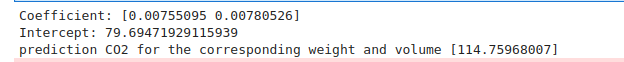

# Implementation of Multivariate Linear Regression
## Aim
To write a python program to implement multivariate linear regression and predict the output.
## Equipment’s required:
1.	Hardware – PCs
2.	Anaconda – Python 3.7 Installation / Moodle-Code Runner
## Algorithm:
### Step1
<br>import pandas as pd.

### Step2
<br>Read the csv file.

### Step3
<br>Get the value of X and y variables.

### Step4
<br>Create the linear regression model and fit.

### Step5
<br> Predict the CO2 emission of a car where the weight is 2300kg, and the volume is 1300cm cube.

### Step6
 Print the predicted output.


## Program:
```python
###DEVELOPED BY:Tamizhselvan.R
###REGISTERED NUMBER: 22002952

import pandas as pd
from sklearn import linear_model
data= pd.read_csv("cars.csv")

X=data[['Weight','Volume']]
Y=data['CO2']

regr=linear_model.LinearRegression()
regr.fit(X,Y)

print("Coefficient:",regr.coef_)
print("Intercept:",regr.intercept_)

predictCO2=regr.predict([[3300,1300]])
print("prediction CO2 for the corresponding weight and volume",predictCO2)


```
## Output:


### Insert your output

<br>

## Result
Thus the multivariate linear regression is implemented and predicted the output using python program.